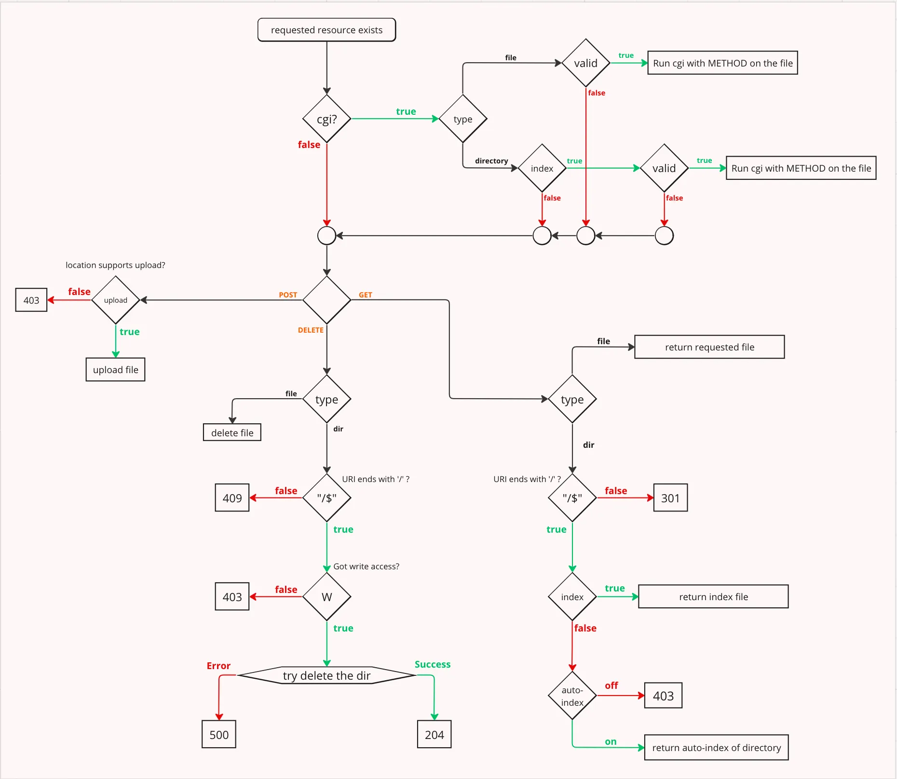

## Concepts for webserv

Be aware of port 443(https)
Config -> The server. config file contains options for installing and configuring a server host that can be dynamically added or removed

**What is a Web Server?**
Whenever you open your browser, type a URL and then click enter. Basically, you are requesting the contents of that URL. Ever wondered where the content are? Yes, you're right those are contents placed on remote computers which, after accepting your request, send the contents of that URL back as a response.

Web Servers are computers that deliver the requested web pages. Every web server has an IP address and domain name.

**Blocking operations**
In the context of web servers, blocking refers to the situation where a thread is waiting for an operation to complete before it can proceed further.
When dealing with input/output (I/O) operations, such as reading from or writing to **sockets**

**sockets** 
Endpoint for a bidirectional communication between two process that comuncate through a network, using protocols as TCP/IP.
ID = IP local/remota y número de puerto

**Asynchronous I/O** allows a server to initiate an I/O operation and continue with other tasks while waiting for the operation to complete. This way, a single thread can manage multiple connections simultaneously without being blocked.

**System calls**
select = the most portable for I/O, but has problem handling multiple FD (less that FD_SETSIZE)
poll(2) / epoll(7) == Dont have the previous limitation
https://man7.org/linux/man-pages/man2/select.2.html

**HTTP  1.0**
The Hypertext Transfer Protocol (HTTP) is a stateless application-level request/response protocol that uses extensible semantics and self-descriptive messages for flexible interaction with network-based hypertext information systems.
https://datatracker.ietf.org/doc/html/rfc9112 
RFCs = Official Internet Protocol Standards

**HTTP MESSAGES**
Consist of a request or response line, headers, an empty line(CRLF or \r\n), and an optional message body.

HTTP-message   = start-line CRLF
                   *( field-line CRLF )
                   CRLF
                   [ message-body ]

start-line     = request-line / status-line

**request-line**   = method  + request-target +  HTTP-version . For example: GET /path/to/resource HTTP/1.1
request-target(URI) =  URI (Uniform Resource Identifier) es una cadena de caracteres compacta que identifica de forma única un recurso físico o abstracto en Internet

**status-line** = HTTP-version + status-code + [ reason-phrase ] . For example: HTTP/1.1 200 OK

**Headers**
Could be in requests and responses, providing additional information about the message.
Parsing headers involves extracting key-value pairs to understand various aspects such as content type, content length, and more. It enables the server to interpret the content appropriately.
Foe example: 
Host: example.com
Content-Type: text/html
Content-Length: 256

**Message Body (opt)**
May contain data relevant to the request or response. Parsing the message body depends on factors like content type and length, transfer coding etc...

**Response process and parsing requests**
Logic to handle different HTTP methods, process requests, and generate appropriate responses.

**NGINX**
It is open-source software designed for maximum performance and stability. Let's see basically why we need it basically see how we can benefit from this.
= config file and its parsing

**CGI**
Common Gateway Interface (CGI) is a standard that facilitates communication between web servers and external databases or information sources. It acts as middleware, allowing web servers to interact with applications that process data and send back responses. The CGI standard was defined by the World Wide Web Consortium (W3C) and specifies how a program interacts with a Hyper Text Transfer Protocol

request & response = API processes
DELETE
POST
GET
Puede venir fragmentado